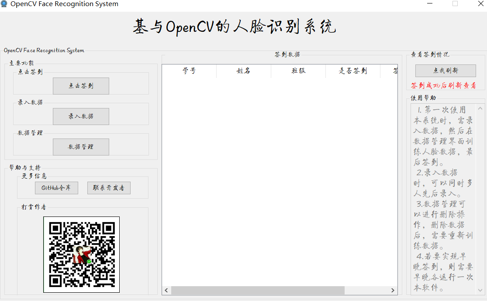

# OpenCV_Recognition
##### 使用OpenCV+PyQt5开发的一个人脸识别签到客户端

含有以下功能：注册，采集人脸数据，训练人脸数据，数据库管理，识别等

使用LBPH作为识别算法。

##### A human face recognition check-in client developed with OpenCV + pyqt5 

 Including the following functions: registration, face data collection, face data training, database management,  Identification, etc 

 LBPH is used as the recognition algorithm.

